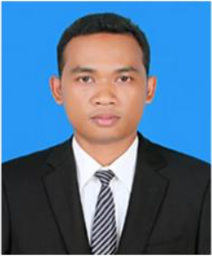

## Members

- **Name**: Rothana Pech (Ph.D.)
- **Email**: pecrothana@itc.edu.kh
- **Position**: Lecturer/Researcher
- **Affiliation**: Institute of Technology of Cambodia (ITC)

::: details **More Information**

Dr. Pech received his Ph.D. in mobile communication engineering from Chung-Ang University, Seoul, South Korea, in 2017. Since then, he has been working as a lecturer and researcher at ITC, Phnom Penh, Cambodia. He is a research scientist who has published several research articles in IEEE, IEICE, Wiley, and MPD publisher. He also serves as a technical reviewer for both national and international journals. Academically, he has received professional training for managing and coordinating engineering curricula of multidisciplinary programs and student studies. He has also been lecturing and supervising students in the field of communication engineering. In addition to academic research, he has been working as a consultant and principal investigator on several projects funded by the Royal Government of Cambodia. His research interests include signal processing for wireless communications such as synchronization, sequence design, estimation theory, detection theory, beamforming and array processing, and Next-Generation 5G/6G mobile communication. Moreover, he is also interested in applied IoT and the application of communication technologies in various information-centric sectors with smart systems.

:::

---

- **Name**: Dara Ron (Ph.D.)
- **Email**: dron@ncsu.edu
- **Position**: Postdoctoral Researcher
- **Affiliation**: NC State University, Raleigh NC, USA

::: details **More Information**

Dr. Ron obtained his PhD degree from Chung-Ang University (CAU), South Korea. He was a full-time researcher within the AINS Lab at CAU and completed his postdoctoral research at George Mason University, Fairfax VA, USA. Currently, he is a postdoctoral researcher in the NextG Wireless Lab at NC State University, Raleigh, NC, USA. Dr. Ron was awarded as a top researcher at CAU. He has published his research articles in IEEE and Elsevier journals, as well as ACM and IEEE conferences. Moreover, he serves as a reviewer for IEEE and Elsevier journals, and as a TCP member of IEEE conferences. Dr. Ron is now collaborating with professors in the USA in writing several research proposals for significant research funds. His research interests include Artificial Intelligence/Machine Learning (AI/ML), Internet of Everything (IoE), Network Security, Reconfigurable Intelligent Surface (RIS), Simultaneous Wireless Information and Power Transfer (SWIPT), Dynamic Spectrum Sharing (DSS), Space Networks, Open-Radio Access Networks (O-RAN), Joint Sensing and Communication (JSAC), Network Analysis and Optimization, and Network Protocols.

:::

---

- **Name**: Lihour Nov (Ph.D.)
- **Email**: lihour.nov@cadt.edu.kh
- **Position**: Lecturer/Researcher
- **Affiliation**: Cambodia Academy of Digital Technology (CADT)

::: details **More Information**

Dr. Nov received his bachelor's degree in Telecommunication and Electronics Engineering from the Royal University of Phnom Penh (RUPP), Cambodia, in 2018. He obtained MSc. and Ph.D. degrees in the Department of Integrated IT Engineering from Seoul National University of Science and Technology (SeoulTech) in South Korea in 2020 and 2023, respectively. During graduate school, he was part of the Electromagnetic Measurement and Applications (EMMA) laboratory, where his research focused on dielectric material characterization, RF/Microwave design, and measurement.
His works have been published in several SCIE journals, including IEEE Access, IET Science Measurement & Technology, Microwave and Optical Technology Letters, and Sensors and Actuators A: Physical, as the main and co-author. Currently, he is working as a full-time lecturer/researcher at the Cambodia Academy of Digital Technology (CADT).

:::

---

- **Name**: Phanam PECH (Ph.D.)
- **Email**: pechphanam@jbnu.ac.kr
- **Position**: Postdoctoral Researcher
- **Affiliation**: Jeonbuk National University, Jeonju-si, South Korea

::: details **More Information**

Dr. Pech received his Master's and Ph.D. degrees from Jeonbuk National University (JBNU), South Korea, in 2019 and 2024, respectively. During his doctoral studies, particularly in 2022 and 2023, he was recognized by JBNU and the JIANT-IT Human Resource Development Center for his outstanding research. He also received the Student Grant from the European Microwave Association and the Travel Grant from the Korean Institute of Electromagnetic Engineering and Science. Additionally, he served as the Chair of the IEEE MTT-S Student Branch Chapter at JBNU. Since completing his Ph.D., Dr. Pech has been serving as a postdoctoral researcher at the JIANT-IT Human Resource Development Center-Brain Korea at JBNU, South Korea. From 2016 to 2017, he worked as a contract lecturer in the Electronics Faculty at NPIC. He has published research articles in prestigious international journals, including IEEE, Wiley, and JEES, and has presented his research at international conferences held in various countries. He also serves as a reviewer for the International Journal of RF and Microwave Computer-Aided Engineering. His research interests include RF/Microwave circuit design, such as power amplifiers, low-noise amplifiers, filtering matching networks, and transmitting system design.

:::

---
