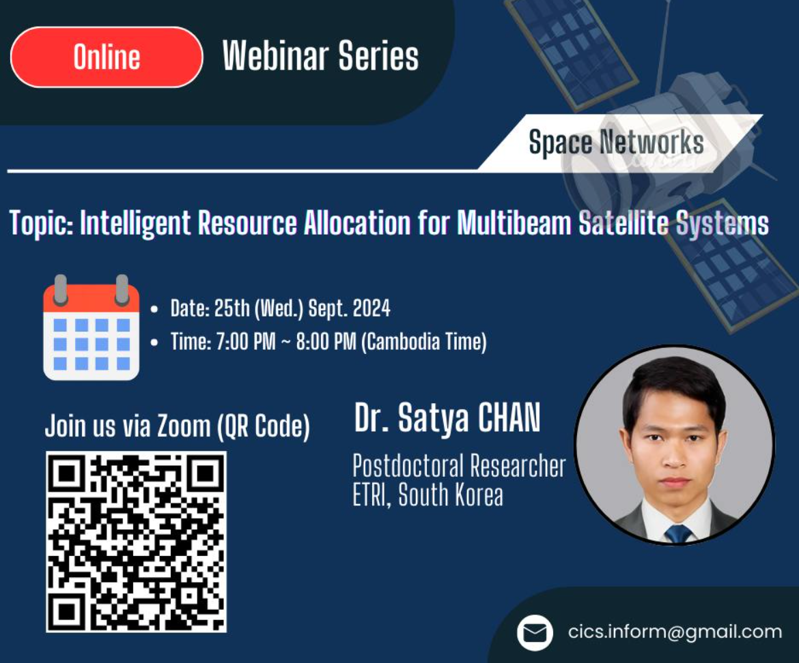

SpaceX's Starlink has already deployed 6,006 LEO satellites in space to provide internet access to users around the globe and has now reached 3 million subscribers. Are you ready to gain insights into space networks? Join us for a transformative webinar where we’ll delve into the research on space networks.
Join us via zoom: https://ncsu.zoom.us/j/3810472620...

Edited

::: center

:::
