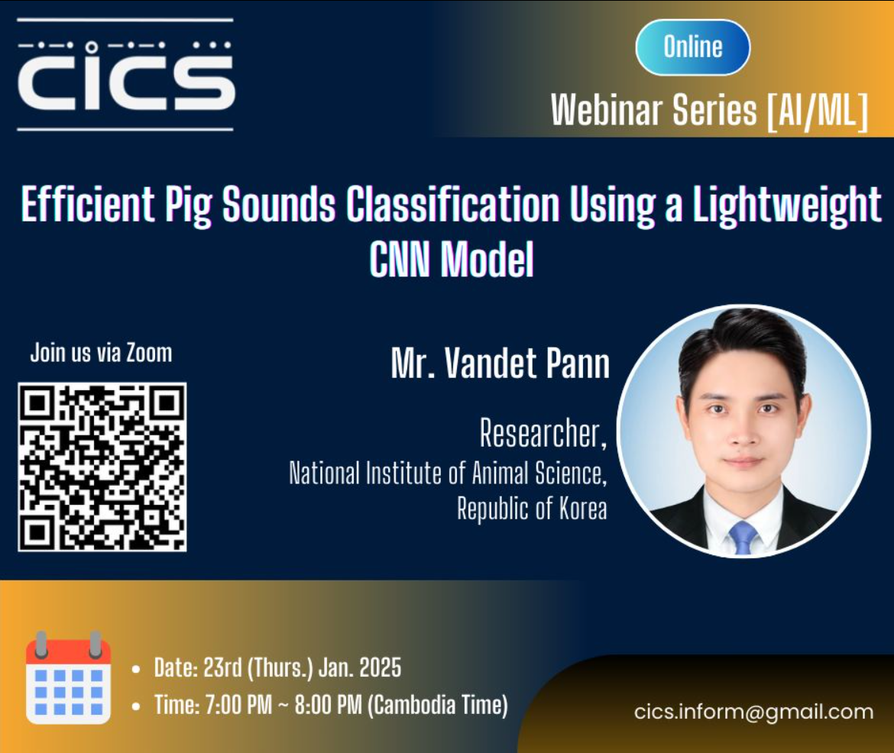

យើងមានសេចក្តីរីករាយក្នុងការអញ្ជើញលោកអ្នកទាំងអស់គ្នាចូលរួមសិក្ខាសាលារបស់យើងក្រោមប្រធានបទ "Efficient Pig Sounds Classification Using a Lightweight CNN Model" ជាមួយនឹងអ្នកស្រាវជ្រាវមកពីវិទ្យាស្ថានស្រាវជ្រាវ NIAS របស់ប្រទេសកូរ៉េ។ លោកនឹងធ្វើបទបង្ហាញទាក់ទងនឹងការប្រើប្រាស់ Machine Learning ទៅក្នុងកសិកម្មចិញ្ចឹមជ្រូក។

We are excited to invite you to our webinar on "Efficient Pig Sounds Classification Using a Lightweight CNN Model," presented by a researcher from the NIAS research institute in South Korea. His talk will focus on the application of Machine Learning in pig farming.

Join us via zoom link: [https://ncsu.zoom.us/j/3810472620...](https://ncsu.zoom.us/j/3810472620?pwd=HLFE2aZdNIMsMhWBwG6Ul5bqoDYx8o.1&fbclid=IwZXh0bgNhZW0CMTAAAR0dPlulpG84vhgF5Of_6e8TGaelyV9trOzwFtTnm_DJwq3E3j5PshZve_I_aem_kvPT5fLmOxk19xszgJEbIg)

::: center

:::
